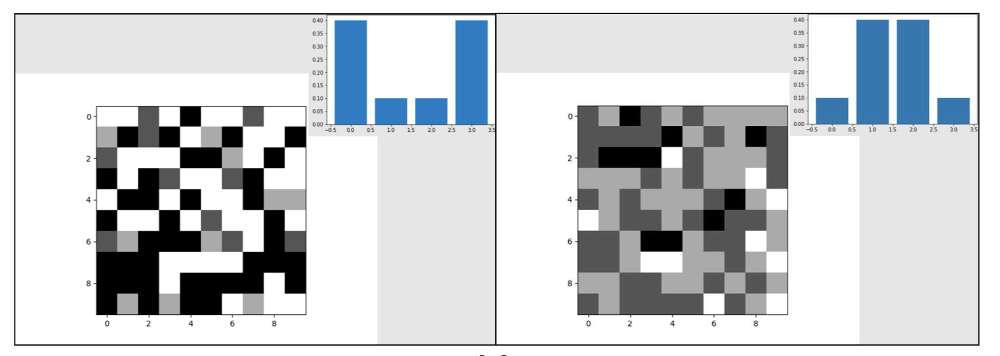
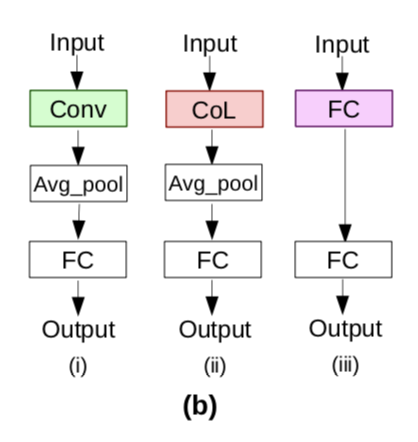
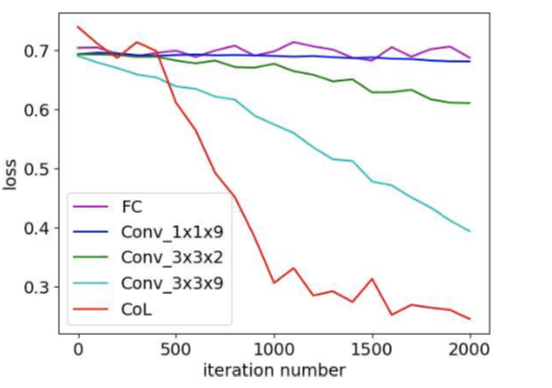
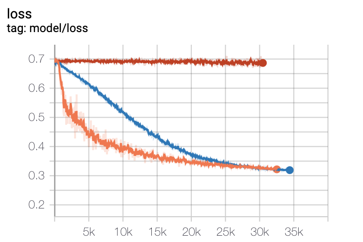
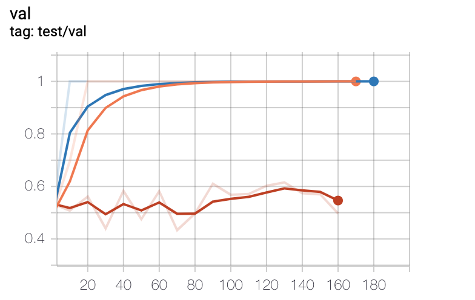

## Note 
#### This repo is pytorch implement for "Co-Occurrence Neural Network"

tensorflow code repo: https://github.com/Shevlev/Co-occurrence-Neural-Network

## Co-Occurrence Convolution
<div align="center">

</div>

## Usage

- clone the repo
```bash
git clone git@github.com:IvanFei/Co-Occurrence-Layer.pytorch.git
cd Co-Occurrence-Layer.pytorch
```

- train the Co-Occurrence Network with gpu
```bash
python main.py --model_name Conn --model_type Conn --mode train --lr 0.00005 --optim adam --gpu_id 0
```

- train the Co-Occurrence Network with cpu
```bash
python main.py --model_name Conn --model_type Conn --mode train --lr 0.00005 --optim adam --gpu_id -1
```

- train the Convolution type Network with gpu
```bash
python main.py --model_name Conv --model_type Conv --mode train --lr 0.00005 --optim adam --gpu_id 0
```

- train the Full-Connected type Network with gpu
```bash
python main.py --model_name FC --model_type FC --mode train --lr 0.00005 --optim adam --gpu_id 0
```

## Co-Occurrence Conv Test Result
<div align="center">
 


</div>


## Comparison with Conv and FC
#### Toy dataset
<div align="center">

</div>

#### Model arch
<div align="center">

</div>

- (i). Conv type model

- (ii). Conn type model

- (iii). FC type model

#### Result
<div align="center">

</div>

<div align="center">



</div>

- top: Paper loss result.
- bottom left: this repo loss result
- bottom center: this repo acc result
- bottom right: legend 

#### Time Consume 
| Models | Conn | Conv | FC  |
| ------ | ---- | ---- | --- |
| Time/s | 557 | 390 | 302 |

## Acknowledgments
(>.<) 
